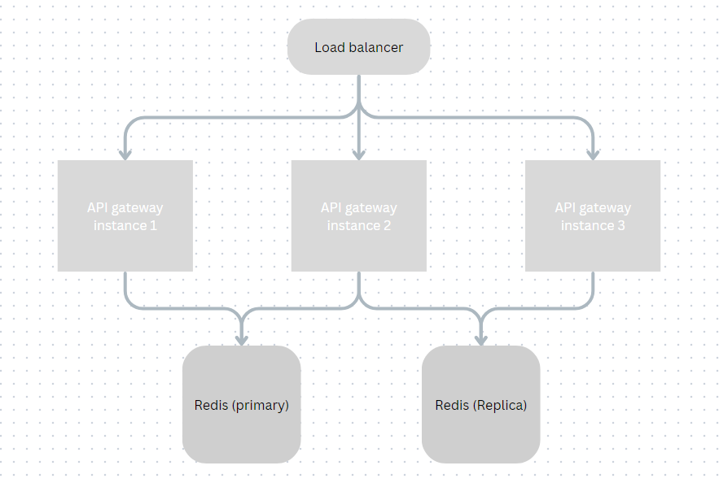

# TEKO-SRE-test


## Overview

This repository contains the implementation of a rate limit core function for an API gateway service. The rate limiting function ensures that the API gateway can handle a high number of requests while enforcing rate limits for individual clients. Additionally, it includes a high-level design for deploying the API gateway in a cluster model with distributed rate limiting.

## 01: Rate Limiting Core Function

### Problem Statement

The rate limit core function should:
- Be called every time a request is received from a client.
- Check if the client's request rate is within the allowed limit.
- Reject requests if the rate limit is exceeded.

### Instructions to run
Run following command to run the code
```
cd ./01
python main.py
```

### Input
- The first line contains two numbers, `N` (number of requests) and `R` (rate limit in requests per hour).
- The following `N` lines contain timestamps (in ISO-8601 format) representing the times of the requests.

### Output
- Each line contains a boolean value (`true` or `false`) indicating whether the corresponding request is accepted or rejected.

### Example Input
```
10 3
2022-01-20T00:13:05Z
2022-01-20T00:27:31Z
2022-01-20T00:45:27Z
2022-01-20T01:00:49Z
2022-01-20T01:15:45Z
2022-01-20T01:20:01Z
2022-01-20T01:50:09Z
2022-01-20T01:52:15Z
2022-01-20T01:54:00Z
2022-01-20T02:00:00Z
```

### Example Output
```
['true', 'true', 'true', 'false', 'true', 'false', 'true', 'true', 'false', 'false']
```

## 02: High-level design for deploying the API gateway in a cluster model

### Problem Statement

As the service grows quickly, the API gateway needs to be deployed in a cluster model. The rate limit core function should work effectively in a cluster environment, ensuring consistent rate limiting across multiple instances.

## Design Components

### 1. Load Balancer
- **Description**: Distributes incoming requests to different API gateway instances, ensuring even load distribution and high availability.
- **Function**: Facilitates horizontal scaling of the API gateway.

### 2. API Gateway Instances
- **Description**: Multiple instances of the API gateway are deployed in a cluster mode to handle incoming requests.
- **Function**: Handle API requests and enforces rate limits.

### 2. Centralized Rate Limiting
- **Description**: Use a distributed data store to maintain request counts and timestamps.
- **Chosen Option**: Redis 
- **Function**: Store rate limit information, ensuring global consistency across all API gateway instances.
- **Key Characteristics**: High read/write throughput, low latency, support for atomic operations.


